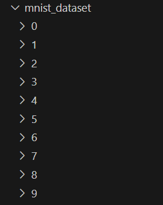

# emsar69/MNIST-AI-Without-External-AI-Libraries

Artifical Intelligence number recognization by images &mdash; using no AI libraries

## Quick Start
> Make sure you have installed cmake and C++ compiler.

### Example Dataset
Use the following structure of handwritten digits dataset:



Rename your dataset folder to `mnist_dataset` or edit the code in `Main.cpp`:
```cpp
load_dataset(inputs, targets, "mnist_dataset", 3000); // Last parameter (3000) means how much data per number.
```

### Building With CMake

In project directory:
```shell
mkdir build
cd build
```

Using MinGW
```shell
cmake -G "MinGW Makefiles" ..
```

Using Ninja
```shell
cmake -G "Ninja" ..
```

Using Clang/Unix Based
```shell
cmake -G "Unix Makefiles" ..
```

### Example output
Example neural network trained with 30k different image/label pairs output:

```log
> .\MNIST_AI.exe
[DEBUG][14:51:03] -> Dataset Loaded: 30000
[DEBUG][14:51:03] -> Training.
[DEBUG][14:51:12] -> Epoch 1 done. Train Accuracy: 91.29% | Test Accuracy: 95.07% | Loss: 0.28
[DEBUG][14:51:20] -> Epoch 2 done. Train Accuracy: 96.38% | Test Accuracy: 95.87% | Loss: 0.12
[DEBUG][14:51:30] -> Epoch 3 done. Train Accuracy: 97.73% | Test Accuracy: 96.80% | Loss: 0.08
[DEBUG][14:51:39] -> Epoch 4 done. Train Accuracy: 98.64% | Test Accuracy: 97.13% | Loss: 0.05
[DEBUG][14:51:48] -> Epoch 5 done. Train Accuracy: 99.15% | Test Accuracy: 97.47% | Loss: 0.03
> example.png
[DEBUG][14:52:43] -> 6.16999e-09 1.08969e-05 5.33723e-05 5.21402e-06 0.999413 3.98535e-08 5.83457e-06 0.000229053 6.17532e-07 0.000281614
[DEBUG][14:52:43] -> Which means, Neural network thinks this is a 4 with 100% confidence.
```

# License
[GNU GENERAL PUBLIC LICENSE 3.0](LICENSE)
